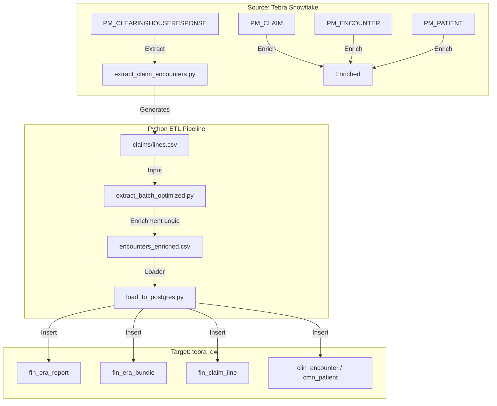

# Tebra Data Extraction & Analytics Architecture

> **Usage Instruction for AI Agents**: Read this document FIRST to understand the data lineage, schema mappings, and specific domain rules before attempting to debug or modify the pipeline.

## 1. High-Level Data Flow

The pipeline matches Electronic Remittance Advice (ERA) files (835 format) from Clearinghouses with Clinical & Financial data stored in Snowflake, and loads the unified dataset into a local PostgreSQL Data Warehouse (`tebra_dw`).

---

## 2. Core Linkage Logic (The "Golden Chain")

Failure to understand this chain leads to "Missing Data" errors.

1.  **ERA Input**: An ERA file contains a claim payment/denial.
2.  **Reference ID Extraction**: The pipeline checks the `CLP` segment or `REF*6R` segment.
    *   **Rule 1 (Claim ID):** If the ID is **Numeric** (e.g., `123456`), it is a `PM_CLAIM.CLAIMID`.
    *   **Rule 2 (Bundle ID):** If the ID is **Alphanumeric** (e.g., `389577Z43267`), it is a `Bundle ID` (often `Ref6R`) and **does NOT** exist in `PM_CLAIM` directly. It links a group of claims.
3.  **Claim Lookup**: Numeric IDs are queried against `PM_CLAIM`.
4.  **Encounter Link**: `PM_CLAIM` links to `PM_ENCOUNTERPROCEDURE` -> `PM_ENCOUNTER`.
5.  **Patient/Provider**: `PM_ENCOUNTER` links to `PM_PATIENT`, `PM_DOCTOR`, etc.

---

## 3. Snowflake Source Schema (Key Tables)

| Table | Key Column | Purpose |
| :--- | :--- | :--- |
| `PM_CLEARINGHOUSERESPONSE` | `CLEARINGHOUSERESPONSEID` | Raw 835 ERA files. Filter on `ReportTypeName = 'ERA'`. |
| `PM_CLAIM` | `CLAIMID` (Numeric) | The central billing entity. Links ERA refs to Clinical data. |
| `PM_ENCOUNTER` | `ENCOUNTERGUID` | The clinical visit. Links to Patient/Provider. |
| `PM_ENCOUNTERPROCEDURE` | `ENCOUNTERPROCEDUREID` | Specific procedures performed during a visit. Links Claim Line -> Encounter. |
| `PM_PATIENT` | `PATIENTGUID` | Demographics (Name, DOB, Address). |
| `PM_DOCTOR` | `DOCTORGUID` | Provider details (NPI, Name). |
| `PM_SERVICELOCATION` | `SERVICELOCATIONGUID` | Facility details. |

---

## 4. PostgreSQL Target Schema (`tebra_dw`)

The local warehouse is normalized into `tin (Financial)` and `clin (Clinical)` and `cmn (Common)` schemas.

### Financial Tables (`tebra` schema in current setup, likely distinct schemas conceptually)

#### `fin_era_report`
One row per ERA file (Check/Payment).
*   `era_report_id`: Primary Key (Source: Snowflake Response ID or MD5 Hash).
*   `denied_count`, `rejected_count`: **Critical Metadata**. Must be calculated from line items to ensure UI consistency.
*   `practice_guid`: Links to `cmn_practice`.

#### `fin_era_bundle` (The "Claim" Header in ERA)
Represents a CLP segment in the ERA.
*   `claim_reference_id`: The ID from the ERA (Numeric ClaimID or Alphanumeric BundleID).
*   `era_report_id`: FK to Report.

#### `fin_claim_line` (The "Service Line")
The atomic unit of analytics.
*   `tebra_claim_id`: PK (Synthetic Hash).
*   `claim_reference_id`: FK to Bundle.
*   `encounter_id`: FK to `clin_encounter`. **Crucial for bridging Financial -> Clinical**.
*   `billed_amount`, `paid_amount`: Financials.
*   `claim_status`, `payer_status`: Denial/Rejection strings.

### Clinical/Common Tables

*   `clin_encounter`: `encounter_id` (PK), `patient_guid` (FK), `provider_guid` (FK).
*   `cmn_patient`: `patient_guid` (PK), `full_name`, `dob`.
*   `cmn_provider`: `provider_guid` (PK), `npi`.

---

## 5. Mapping & Transformation Rules

### A. ERA to Claim Mapping
*   **Source**: `EraParser` output from `file_contents`.
*   **Dest**: `extract_batch_optimized.py` -> `lines_map`.
*   **Logic**:
    *   Extract `ClaimID` or `Ref6R`.
    *   If Numeric: Query `PM_CLAIM` where `CLAIMID = ID`.
    *   If Alphanumeric: Treated as "Unlinked Bundle" (Clinical linkage skipped currently, but Financials preserved).

### B. Count Recalculation (Critical for Data Integrity)
The `load_to_postgres.py` script performs a **Phase 4 Consistency Check**.
It runs a SQL `UPDATE` on `fin_era_report` to recalculate `denied_count` and `rejected_count` by counting actual rows in `fin_claim_line` linked to that report.
*   **Why?** The raw counts in the CSV/Header are often unreliable or don't match the filtered line items loaded.
*   **Rule**: The Database (`tebra_dw`) is the Source of Truth for counts, not the CSV.

### C. Practice Linkage
*   **Issue**: Some ERAs lack a clear `PracticeGUID` in the raw file.
*   **Fix**: `orchestrator.py` passes the `PracticeGUID` from the extraction loop context down to the loader. The loader ensures `fin_era_report.practice_guid` is populated.

---

## 6. Pipeline Scripts

1.  **`orchestrator.py`**: The entry point. Manages the workflow for all practices.
    *   Calls `extract_all_eras`
    *   Calls `validate_extraction`
    *   Calls `extract_batch`
    *   Calls `load_to_postgres`
2.  **`extract_claim_encounters.py`**: Connects to Snowflake, verifies `PM_CLEARINGHOUSERESPONSE`, parses 835s, outputs `eras_extracted.jsonl` and `service_lines.csv`.
3.  **`extract_batch_optimized.py`**: Takes `service_lines.csv`. Queries `PM_CLAIM`, `PM_ENCOUNTER`, etc. Outputs `encounters_enriched_deterministic.csv`.
4.  **`load_to_postgres.py`**: Reads CSVs. UPSERTS data into Postgres. **Performs the Count Recalculation**.

## 7. Troubleshooting Guide

*   **"Modal is Empty"**:
    *   Check if `fin_claim_line` has rows for that `era_report_id`.
    *   Check if `fin_era_bundle` exists.
    *   Root Cause: Usually `Ref6R` was Alphanumeric (Bundle) and pipeline failed to create lines, OR `PracticeGUID` mismatch hid the ERA.
*   **"Missing Denied Count"**:
    *   Run Phase 4 of `load_to_postgres.py` to force recalculation.
*   **"Linkage Errors"**:
    *   Run `audit_linkage_quality.py`.
    *   Ensure you strictly distinguish Numeric (Claims) vs Alphanumeric (Bundles).

---

## 8. Practice Selection Logic

The pipeline selects practices based on the following criteria (Ref: `orchestrator.py`):

1.  **Status**: `ACTIVE = TRUE` (Note: Code matches this logic).
2.  **Data Availability**: Must have at least one record in `PM_CLEARINGHOUSERESPONSE`.
3.  **Schema Constraint**: `PM_PRACTICE` table does **not** have a `PracticeType` or `Specialty` column.

**Implication**: Practices that are Inactive (churned) but have historical ERAs are **currently EXCLUDED** by the SQL filter.

---

## 9. Clearinghouse Response Types Breakdown
Based on analysis of `PM_CLEARINGHOUSERESPONSE` (e.g., for Performance Rehab):

| Response Type | Count (Sample) | Status in Pipeline | Notes |
| :--- | :--- | :--- | :--- |
| **ERA** | ~508 | **PROCESSED** | Parsed into Claims/Lines. The core dataset. |
| **Processing** | ~3419 | **LOGGED (Ignored)** | Status updates/Acknowledgments. Saved to `rejections.csv` but NOT parsed. |
| **Other** | Minimal | **LOGGED (Ignored)** | Any other type (999, 277) is treated as non-ERA. |

**Key Takeaway**: The vast majority of "Responses" are operational status updates (`Processing`), not financial data (`ERA`). The pipeline correctly filters for `ERA` to avoid noise.

---

## 10. Detailed Field Extraction Mapping

The user asked: *"Are we extracting all fields such as reject and denied counts?"*
**YES.** The pipeline explicitly selects these 22 columns from Snowflake (`extract_claim_encounters.py`):

| Snowflake Column | Postgres/CSV Column | Purpose |
| :--- | :--- | :--- |
| `CLEARINGHOUSERESPONSEID` | `era_report_id` | Primary Key |
| `ITEMCOUNT` | `claim_count` | Number of claims in the file |
| `DENIED` | `denied_count` | count of denied claims (Source of Truth 1) |
| `REJECTED` | `rejected_count` | count of rejected claims (Source of Truth 1) |
| `TOTALAMOUNT` | `total_amount` | Check Amount |
| `PAYMENTID` | `payment_id` | Check/EFT Trace Number |
| `PROCESSEDFLAG` | `processed_flag` | Status flag |
| `FILECONTENTS` | *(Parsed)* | The raw 835 EDI content |

**Note on Counts**: While we extract the raw counts (`DENIED`/`REJECTED`) from Snowflake, `load_to_postgres.py` **re-calculates** them from the actual parsed line items during Phase 4. This double-check ensures the UI reflects exactly what is in the database.
